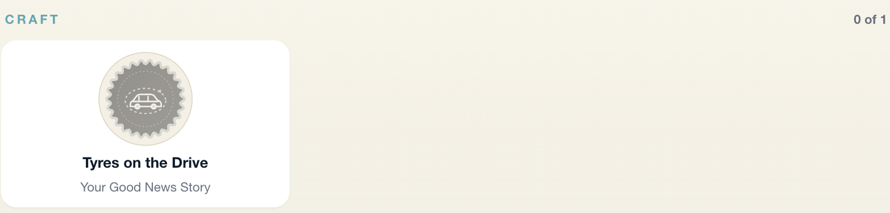
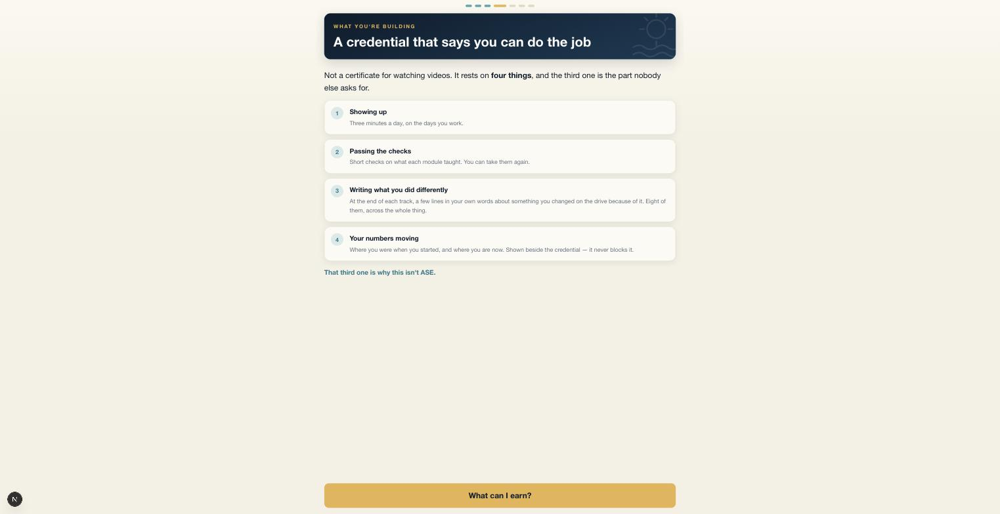

# Phase 3e — The Good News Story

*Sunday 20 September 2026. Branch `good-news-story`, **PR open, not merged.**
`0127_good_news_story.sql` is written and validated on a full local replay —
**not applied.** Piece A and Piece B are both built; A is the launch-facing half.*

---

## 1. The flag — name and read site

```
game_settings.story_required        boolean not null default true    (0127 §1)
```

**Read in exactly one place:** `loadStoryGate()` in `lib/story.ts`. Nothing else
in the codebase touches the column.

Turning it off:

```sql
update game_settings set story_required = false;
```

No migration, no deploy. That is only true while there is one read site, so a
second one is a bug rather than a convenience — said in the migration comment
and in the function's doc.

**It ships ON.** A gate like this would normally go on dark, but there is no
cohort to strand: the eight-to-fifteen month clock starts 1 October, so no
advisor completes a track before February. Shipping it **off** would create
exactly the mismatch the flag exists to prevent — a first cohort whose tracks
completed under different rules.

`loadStoryGate` **defaults to required** when the row or the read is missing, and
takes its errors rather than `?? []`-ing them. A failed read quietly turning the
requirement off is a credential handed out because a query failed.

---

## 2. The four RLS refusals, each proven non-vacuous

`npm run accept:story` — **24 passed, 0 failed**, over PostgREST, as the role
that really calls. Two rooftops, so "across rooftops" is a real boundary.

| # | Rule | The refusal | Proven non-vacuous by |
|---|---|---|---|
| **1** | An advisor reads and writes **their own** | a colleague's insert in the author's name is **rejected** | the author reads their own story back through the same client |
| **2** | A manager reads **their own rooftop** | an advisor cannot read a colleague's unshared story | **the same client** reads **its own** story from **the same table** |
| **3** | Shared reaches that rooftop, **only when shared** | before sharing, the peer sees nothing | flipping `shared_to_team` makes **the identical read** return it |
| **4** | **Nobody across rooftops** | a manager at store B reads nothing of store A's | **the same manager client** reads a story at **its own** rooftop |

Every non-vacuity pairing is deliberately the *same client, same table, same
query* with one fact changed. A test asserting "this returns nothing" passes
just as well when the relation is missing, the login failed, or the fixture was
never written — so each refusal is paired with the read succeeding for somebody
entitled to it.

Rule 2's proof needed one extra step worth naming: the manager check is run
**with `shared_to_team` off**, otherwise rule 2 would have been proved by rule
3's arm and neither would be tested.

Also refused, and also paired:

- a manager at another rooftop cannot `mark_story_reviewed` — while the rooftop's
  own manager can, and it records **who and when**
- a manager at another rooftop cannot read the **revisions** either
- **a story cannot be deleted by anyone** — no delete policy exists, so the
  statement is refused for everyone; the author retires it instead, and the
  unique index is partial so the slot frees up

`my_story_for()` returns **true** for the author and **false** for an advisor who
has not written one — the discriminating pair, because a function that always
said false would have passed a one-sided test.

---

## 3. The leg is on the track, not the day

`dayGate.ts` carried the story formula in a comment. **That was in the wrong
file**, and the correction is in this branch:

> A story does not complete a MORNING. It completes a TRACK. An advisor who
> writes one has not finished that day's ritual; they have finished eight months
> of work.

The gate now lives beside the module rule, in `lib/certification.ts`:

```ts
const TRACK_LEGS = [
  { key: "modules", required: () => true,          met: (t) => certificationEarned(t.modules) },
  { key: "story",   required: (t) => t.storyRequired, met: (t) => t.storySubmitted },
];

export function trackComplete(t: TrackState): boolean {
  return trackLegs(t).every((l) => !l.required || l.met);
}
```

**The legs are data**, the same discipline `dayGate` uses. Removing the story
later is deleting an entry — not unpicking a condition from three call sites,
which is how a leg ends up removed everywhere but one place.

`dayGate.ts` is otherwise untouched by this phase.

---

## 4. Ruling 5 — an unwritten story is loud

`statusLine` used to say **"Finishing up"** to an advisor at 100% of modules —
true, useless, and indistinguishable from the app thinking. It now names it, and
reads like `describeOutstanding` does every morning so the track does not invent
a second voice.

**The screenshot asked for** — a track at 100% of items and 100% of modules,
unearned, with the story outstanding:



Full page: `phase-3e-screens/02-track-100pct-story-outstanding.jpg`.
State behind it, verified in SQL as the advisor before the screenshot:

```
total_items 3 · done_items 3 · total_modules 1 · done_modules 1 · my_story_for false
```

Reproduce with `npm run fixture:story`.

---

## 5. Piece A — onboarding says the credential on day one



A new screen, placed **before** the gear rather than after — an advisor who meets
the swag first reads the whole product as a points app.

> **What you're building — A credential that says you can do the job**
>
> Not a certificate for watching videos. It rests on **four things**, and the
> third one is the part nobody else asks for.
>
> 1. **Showing up** — three minutes a day, on the days you work.
> 2. **Passing the checks** — short checks on what each module taught.
> 3. **Writing what you did differently** — at the end of each track, a few lines
>    in your own words about something you changed on the drive because of it.
>    Eight of them, across the whole thing.
> 4. **Your numbers moving** — where you were when you started, and where you are
>    now. Shown beside the credential — **it never blocks it.**
>
> *That third one is why this isn't ASE.*

The fourth leg is phrased as **movement, not a target**, because Ruling 6 forbids
a causal claim and a promise that the credential needs a number to go up would be
both unsupportable and a different product.

### Two things onboarding was already getting wrong, found while building this

Neither was in the brief. Both are the same defect as the one Piece A exists to
fix — a false statement made to every new user in their first week — and both are
fixed in this branch.

- **The loop list described the pre-3b morning.** "A quote to start on… the Pick…
  two films." The live loop has been **mindset → pitch → item, quote as the
  close** since `b2cdd64`. An advisor was told one order and handed another *on
  the very next screen*, which is precisely what the comment above that list warns
  against. Rewritten against `DailyFlow`'s actual steps.
- **"No classroom. No binder. No homework."** The story is writing. Not homework
  in the binder sense, and not nothing either. The claim goes rather than getting
  quietly stretched: **"No classroom. No binder. Nothing to take home."** The
  rhythm of three survives; the promise we cannot keep does not.

---

## 6. Report, do not act — the retention and visibility posture

Advisors typing free text about customers and colleagues, stored and readable by
management, is an HR surface. **Proposed, not decided.** Nothing below is built.

| Question | Proposal | Why |
|---|---|---|
| **How long are stories kept?** | For the life of the credential, plus the credential's own currency window. Not indefinitely. | The story is evidence for a claim; when the claim expires the evidence has no further purpose. A permanent record of an employee's words needs a reason, and "we had the column" is not one. |
| **Can an advisor delete one?** | **Retire, not delete** — already built. The author withdraws it, the slot frees, the text stays readable to them and their manager. | A story that vanishes after a manager read it is a hole in a record somebody relied on. But an advisor who regrets what they wrote must have a way out that is not "ask your boss". |
| **A hard delete on request?** | **Ryan and Mitch to rule.** My proposal: yes, on written request, through an admin path that logs the request — not a button. | Some jurisdictions will require it. A self-serve hard delete on an HR record is a different risk. |
| **What happens when an advisor leaves?** | Stories stay, attached to the **rooftop stamped on the row** — not to current membership. Already built that way. | An advisor who moves stores must not drag old stories into a new manager's view, nor lose them from the old one. Membership is current state; the row is history. |
| **What does a manager see about a departed advisor?** | The stories written **while that advisor was at their rooftop**, and nothing after. | The rooftop stamp gives this for free. The alternative — joining through membership at read time — silently changes who can read what every time somebody transfers. |
| **Should sharing be revocable?** | Yes, and it already is — `shared_to_team` is an ordinary update by the author. | An advisor who shares and regrets it should not need help. |

**One thing I would raise with Mitch specifically:** the advisor is writing about
*customers*. Nothing in the product tells them not to use a customer's name, and
nothing redacts one. That is a policy question before it is a code question, and
it is cheaper to answer before 1 October than after the first story names
somebody.

---

## 7. The two assumptions, flagged rather than worked around

Both are yours rather than Mitch's, both built as stated, both one line to
reverse:

1. **Submission counts immediately; manager review is visible but never
   blocking.** Built: `my_story_for()` tests only for a live row.
   `reviewed_by`/`reviewed_at` gate nothing. To make review blocking, the leg's
   `met` becomes "reviewed" — one line in `TRACK_LEGS`.
2. **Sharing is the advisor's choice, off by default.** Built:
   `shared_to_team boolean not null default false`.

---

## 8. Verification

```
accept:story          24 passed, 0 failed     ← new
accept:family         34 passed, 0 failed
accept:loop           77 passed, 0 failed
accept:focus-family   43 passed, 0 failed
test:streak          127 passed, 0 failed
test:certification    70 passed, 0 failed
test:watch            67 passed, 0 failed
test:day-ticket       35 passed, 0 failed
test:rest-day         22 passed, 0 failed

supabase db reset --local   0001 → 0127 clean
tsc --noEmit                clean
eslint                      0 errors (9 pre-existing warnings)
next build                  ✓ Compiled successfully
```

**0127 is not applied.** `pg_dump` first, Ryan applies.

`TWO_LADDERS.md` §PROPOSED, NOT DECIDED is gone, replaced by **§BUILT** recording
what shipped, how each reversibility constraint was met, and the RLS rules.

### One thing that went wrong in my own fixture, worth the line

The screenshot fixture printed `items 3 of 3 done · modules 1 of 1 complete` while
`content_progress` had rejected **every row** for a missing `rooftop_id` — because
I did not take the error. A fixture reporting a state it failed to create is the
same defect as the code it exists to photograph. It takes its errors now, and the
screenshot above was retaken against a state verified in SQL rather than trusted
from the fixture's own output.

I also matched an advisor by `full_name` and got the wrong one of two rows with
the same name, then backfilled onto a user who was not the browser session. The
fix was to derive the id from the session rather than the label.

---

## 9. State

```
$ git status -sb
## good-news-story...origin/good-news-story
 M .gitignore
?? data/File.png

$ gh pr view 10
PR #10  OPEN  MERGEABLE  good-news-story -> main  files 18
```

No ahead count — the branch is pushed and level with its remote. **Nothing on `main`.**

The two standing exclusions remain on your disk and out of the PR: `.gitignore`
(Drop Zone scope) and `data/File.png` (a stray). `backups/` is gitignored.
