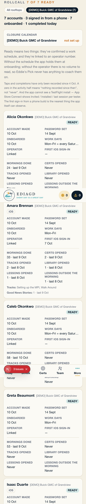

# Rollcall — who installed, signed in, onboarded, completed, and browsed

Ryan, 6 October: *"I want to know who downloaded the TestFlight app and when, who
created their password, who completed onboarding, who completed a daily loop, who
clicked on Certs and other courses, and who completed lessons outside the daily
loop. Slack it to #ediagd too."*

---

## 1. The migration

**`0163_rollcall_events.sql`** — `app_event`, plus the aggregate both readers use.

| | |
|---|---|
| table | `app_event (id, user_id, rooftop_id, kind, target_id, meta, at, dedup_key)` |
| `kind` | CHECK constraint on the seven kinds. An unfamiliar kind is a 23514 at the moment it is written, not a row nothing counts |
| `rooftop_id` | **NOT NULL.** The read policy keys on it, so a nullable column would produce rows invisible to the gate and excluded by nothing — 0128's `placement = NULL` again |
| `target_id` | polymorphic, **no FK** — the kind names the table. Readers must count an event whose target they cannot resolve |
| `dedup_key` | `<user>:signed_in:<store date>`, partial-unique. Only `signed_in` sets one; four taps on Certs in a day are four opens |
| indexes | `(rooftop_id, at desc)`, `(user_id, kind, at desc)` |
| RLS | enabled **and forced**. One policy: `is_platform_owner() or rooftop_id in (select managed_rooftops())` |
| grants | `select` to `authenticated`; **no insert for anon or authenticated**. The service role is the only writer |
| view | `app_event_rollcall`, `security_invoker = on`, grouped per (user, rooftop, kind, platform, source) |

`managed_rooftops()` is **called, not restated** — a policy that spelled out the
membership check would silently drop the group roles the helper unions in, which
is the bug 0115 was caught on.

**An advisor reads nothing, not even their own rows** — same shape as `feedback`
(0154). This is a record *about* them kept *for* the team.

Chain replayed clean: **0001 → 0163** via `supabase db reset --local`.

---

## 2. The event kinds, and where each is written

| kind | written by | meta | target |
|---|---|---|---|
| `signed_in` | `components/events/RecordOpen.tsx` → `recordSignInPing` (mounted in the `(app)` layout) | `platform: ios \| android \| web` | — |
| `certs_opened` | `<RecordOpen>` on `/certifications` | — | — |
| `track_opened` | `<RecordOpen>` on `/certifications/[slug]` (**both branches**) | — | certification |
| `library_opened` | `<RecordOpen>` on `/library` | — | — |
| `lesson_opened` | `<RecordOpen>` on `/library/m/[module]` | — | module |
| `lesson_completed` | `completeLibraryItem` and `completeDay`'s item path | `source: loop \| library \| card`, `content_id` | module |
| `story_submitted` | `submitStory`, **insert branch only** (an edit is not a submission) | — | certification |

### The opens are fired from a client mount effect, and that is the design

Next renders a route's server components on **prefetch**, and `/certifications`
is on the tab bar of every signed-in screen. A page that logged its own open
from inside its server render would have counted every prefetch. A prefetch
does not *mount* anything, so the write behind a mount effect is true by
construction rather than by everyone remembering. Proved: **one visit, exactly
one `certs_opened`.**

### Trust boundary

`recordOpen` accepts a kind from the browser, but only from a four-item
whitelist. `lesson_completed` and `story_submitted` are **not** assertable by a
client — they are emitted after `completeDay` / `completeLibraryItem` /
`submitStory` have verified the thing happened. Said plainly: somebody
determined can POST four open events without opening anything. Accepted — an
open count is telemetry, not an entitlement, and the user id and rooftop always
come from the session.

---

## 3. Two things the brief and the codebase disagreed about

### `content_progress.source` already existed, and nothing was writing it

The brief says a lesson completed in the library is indistinguishable from one
completed in the morning. **That was not quite true.** 0123 added
`content_progress.source` (`loop | card | library | quiz`) for exactly this
question and commented that provenance "is not recoverable afterwards".

It was right, and then **the only production writer was `completeDay`, writing
`'loop'`.** `completeLibraryItem` — the one path both the library deck and the
family card finish a lesson through — had no parameter for it, so every library
and card completion in production carries `source = NULL`. A column that answers
"which surface" is only as strong as the guarantee that something writes it, and
the one writer declined.

**Fixed where the value is created.** `completeLibraryItem(contentId, surface,
watchedPct?)` — `surface` required and positional so no caller can take a
default, stamped on **both** claim paths (the insert *and* the on-conflict
completion, because on a credit-only player `record_watch_progress` has usually
already inserted the row, so the UPDATE is the completing write). Two call
sites: `CueDeck` → `library`, `ServiceShelf` → `card`.

**So why keep the event at all?** Because `content_progress.source` is
**last-writer-wins**: one row per `(user_id, content_id)`, and `completeDay`
upserts it, so a film finished in the library and later served as a morning
pitch has its source rewritten to `'loop'`. The column answers *which surface
touched this row most recently*; Ryan asked *which surface finished it*.
`app_event` is append-only. The two are now **reconcilable rather than
redundant**, which is what makes either worth quoting.

### Vocabulary

The brief says meta source is "morning or library". It is **`loop | library |
card`** — 0123's existing CHECK vocabulary — so the two records can be compared
directly, and because the family card is outside the loop *and* outside the
library and shouldn't be filed under either name.

---

## 4. Rollcall

`components/admin/OnboardingStatus.tsx` → `components/admin/Rollcall.tsx`.
`lib/rollcall.ts` layers the event facts onto `loadOnboardingStatus` — one
loader, read by both the screen and the Slack cron.

Two blocks per advisor. **Set up:** account made, password set, onboarded, work
days, operator, first iOS/Android sign-in. **Did:** mornings done, Certs opened,
tracks opened, library opened, lessons opened, lessons outside the morning —
plus the track names and any Good News Stories.



### Three things the screen is careful about

- **"Installed" is not a column.** The app cannot see a TestFlight install —
  that is per tester in App Store Connect. The field is headed **First iOS
  sign-in** and the note says where the real record lives.
- **The "recording since" date is derived**, not typed into the copy, so it
  cannot become a label that was true the week it was written.
- **Two integrity lines print only when they fire**: `lesson_completed` events
  with no source (in neither column — guessing would be the exclusion-by-value
  mistake pointing the other way), and any advisor with more in-morning lesson
  events than completed mornings, which cannot happen because a morning serves
  at most one item. That second one is the second route to the same quantity.

### Rooftop filter

`?roof=<id>`, scoped to the Rollcall section only — the engagement half above it
keeps the viewer's full policy scope, because two scopes on one screen with one
word for both is how they end up disagreeing. Chips cover **only rooftops with
accounts**, ordered accounts-descending so the store being rolled out leads
without anybody hard-coding its name, capped at 8 with the overflow stated.

> **The first build chipped every rooftop in scope.** The screenshot showed what
> that means: ~100 demo chips, eight thousand pixels, the actual roll somewhere
> underneath — in direct violation of this page's own header rule that it *"must
> read the same for a dealer admin with one rooftop and a platform owner with
> hundreds"*. Caught by looking at the artifact, not by a test.

---

## 5. Slack

`app/api/cron/rollcall/route.ts`, protected exactly as `streak-saver` is
(`CRON_SECRET`; a missing secret is a refusal, not a default-open).

**Schedule** — `vercel.json`: `30 12,22 * * *`.

> That is **07:30 and 17:30 Central Daylight** (UTC−5). Vercel crons are UTC and
> do not observe DST, so from the first Sunday in November to the second Sunday
> in March they fire at **06:30 and 16:30 Central**. Accepted rather than worked
> around: `streak-saver` runs hourly and checks each rooftop's clock because a
> 7pm notification at the wrong hour is wrong; an hour's winter drift on a
> status post is not worth 24 invocations a day for two messages. There is no
> comment in `vercel.json` because Vercel validates that file and rejects
> unknown keys — the note lives in the route header.

**Rooftop** — `?rooftop=<uuid>`, else `ROLLCALL_ROOFTOP_ID`. There is
deliberately **no name lookup** (a name match returns the wrong row without
erroring) and **no "whichever store has most accounts" fallback** (it would
silently re-target the week a second store onboards). With neither set the route
**refuses with 503** and the heartbeat records why.

**What changed since the last post** is keyed on the last **successful** post,
kept in `cron_heartbeat.detail.posted_at` and advanced only when Slack actually
accepted. If it were `ran_at`, a failed post would swallow the window it failed
to report. The comparison is on the four tables' own **instants**, not on the
dates the screen shows, so two posts a day are distinguishable.

**The message, as posted** (captured from a stand-in webhook):

```
*EDIAGD Rollcall* · [DEMO] Buick GMC of Grandview · Sat 10 Oct, 10:41
7 accounts · 1 signed in from a phone · 7 onboarded · 1 completed today
_1 advisor has something new since Sat 10 Oct, 10:41._

• *Alicia Okonkwo* — phone — · pw 14 Sept · onboarded 10 Oct · 24 mornings (last 9 Oct) · Certs 0, tracks 0 · 0 outside the morning
• *Amara Brennan* — phone — · pw 14 Sept · onboarded 10 Oct · 33 mornings (last 9 Oct) · Certs 0, tracks 0 · 0 outside the morning
• *Caleb Okonkwo* — phone — · pw 14 Sept · onboarded 10 Oct · 58 mornings (last 10 Oct) · Certs 0, tracks 0 · 0 outside the morning
• *Greta Beaumont* — phone — · pw 14 Sept · onboarded 10 Oct · 53 mornings (last 9 Oct) · Certs 0, tracks 0 · 0 outside the morning
• *Isaac Duarte* — phone — · pw 14 Sept · onboarded 10 Oct · 15 mornings (last 5 Oct) · Certs 0, tracks 0 · 0 outside the morning
• *Logan Novak* — phone iOS 10 Oct · pw 17 Sept · onboarded 10 Oct · 7 mornings (last 25 Sept) · Certs 1 (last 10 Oct), tracks 0 · 0 outside the morning
      ↳ new: signed in from a phone, Certs
• *Sofia Trujillo* — phone — · pw 18 Sept · onboarded 10 Oct · 7 mornings (last 24 Sept) · Certs 0, tracks 0 · 0 outside the morning
```

Everybody is listed every time, all six facts in the same order whether or not
there is anything in them — a line that omitted the empty facts would make the
people who did nothing the hardest to spot. Over 40 advisors the list is capped
**and says how many it dropped**.

**Ryan sets two env vars on Vercel**: `SLACK_ROLLCALL_WEBHOOK` (the #ediagd
incoming webhook) and `ROLLCALL_ROOFTOP_ID` (Beaumont's rooftop uuid). Until
both are set the cron returns 503/502 twice a day — deliberately, so an
unconfigured job does not report success. The webhook URL appears nowhere in
the repo or in this report.

---

## 6. Proof

### `npm run accept:rollcall` — 37 passed, 0 failed

Over PostgREST, as the roles that really call. **The acceptance half runs first**,
so nothing below can pass against an empty table or an unreadable relation.

| | |
|---|---|
| platform owner / admin / manager read their rooftop's 9 events | ✓ |
| …and the same 9 through the view, which agrees with the table | ✓ |
| advisor reads **zero**, including their own, by rooftop and by user id | ✓ |
| advisor reads **zero through the view** as well | ✓ |
| manager at store B reads zero of store A's — **and does read B's** | ✓ |
| advisor cannot INSERT; **an admin cannot either** | ✓ |
| an unfamiliar kind is refused, even to the service role | ✓ |
| a null rooftop is refused | ✓ |
| a second sign-in ping in one store-day is refused (23505)… | ✓ |
| …and a repeat *open* is **not** deduped | ✓ |
| `loadRollcall` reports all six facts, names the track, keeps the quiet advisor on the roll, and does not leak store B | ✓ |
| the change window is real — nothing is "new" since a minute from now | ✓ |

**Proven non-vacuous, twice:**

```
app_event_team_read → using (true)          33 passed, 4 failed
  ✗ advisor reads ZERO of app_event at their own rooftop     got 9
  ✗ advisor reads ZERO of their OWN rows asked for by user id got 9
  ✗ advisor reads ZERO through the VIEW as well               got 8
  ✗ manager at B reads ZERO of A's events                     got 9

app_event_rollcall → security_invoker = off  36 passed, 1 failed
  ✗ advisor reads ZERO through the VIEW as well               got 8
```

The second is the sharper one: it isolates the definer-view failure — the gate
lost in the one place nobody looks for it — while every table assertion stays
green.

### `npm run verify:rollcall` — 15 passed, 0 failed

`accept:rollcall` writes its events with the service client, so it proves
nothing about whether the **app** ever writes one. This drives a real fixture
advisor through headless Chrome against a real dev server: four screens, the
real cue deck, the real story form.

```
✓ signed_in from the layout's ping, carrying a platform
✓ certs_opened · track_opened (targeting the certification) · library_opened
✓ lesson_opened (targeting the module)
✓ lesson_completed with source library, from the real deck
✓ story_submitted from the real form, targeting the certification
✓ content_progress.source is 'library' — the column 0123 added and nothing had ever written
✓ exactly one certs_opened for one visit, not one per prefetch
```

`lesson_completed` with `source: loop` is written by `completeDay`, exercised by
**`accept:loop`** driving real morning completions:

```
lesson_completed | {"source": "loop", "content_id": "2345f639-…"} | target: yes | 1
lesson_completed | {"source": "loop", "content_id": "1947bada-…"} | target: yes | 1
```

(`accept:loop` itself: 74 passed, 3 failed — **the same 3 on `main` with my
`completeDay` change stashed**, so they are pre-existing and not caused here.
They are about `module_completion` not being written locally, which the local
seed's empty module table explains.)

### The cron, exercised five ways

| | |
|---|---|
| no auth header | **401** |
| wrong secret | **401** `{"error":"unauthorised"}` |
| `?rooftop=not-a-uuid` | **503** + heartbeat |
| well-shaped but unknown rooftop | **503** `no rooftop with id …` |
| configured, webhook up | **200** `posted: true`, message received |
| second run, nothing changed | **200** `changed: 0`, `since` = the first post |
| after one advisor's activity | **200** `changed: 1`, that line marked `↳ new:` |
| webhook killed | **502** `posted:false reason:error`, **`posted_at` preserved at the last successful post**, `ran_at` moved |

### Clean

`tsc --noEmit` ✓ · `eslint` 0 errors (13 pre-existing warnings, none in new
files) ✓ · `check:nav` ✓ (no new top-level route; `/api/cron/rollcall` is
outside `app/(app)`).

---

## 7. What is **not** proved, and what is left

1. **Platform `ios` from a real device.** `nativePlatform()` reads
   `Capacitor.getPlatform()`, which only means anything inside the shell, so
   headless Chrome correctly reports `web`. The server half **is** proved —
   `accept:rollcall` stores and reads back `platform: ios` — so what is
   unproven is three lines of bridge code. **Ryan: install the TestFlight
   build, sign in, and the Rollcall row should read "First iOS sign-in —
   today".**
2. **The Slack post against the real webhook.** Proved against a stand-in that
   captured the exact bytes. The real one needs Ryan's env.
3. **`content_progress.source` is NULL for every library and card completion
   before this PR.** Not backfilled: stamping them `'library'` would assert a
   fact nobody checked. Null means "written before anything recorded this",
   which is true.
4. **Nothing is backfilled into `app_event`.** The activity half starts empty
   and the screen says so, with a derived date.

### Two bugs this work found in its own gates

- **The uuid regex refused a good id.** Written as the usual RFC-4122 pattern
  (`[1-5]` version, `[89ab]` variant), it rejected rooftop
  `318b0b2d-f70d-e8da-8837-397ffa642975` — `e` where a version should be.
  Postgres accepts any 32 hex digits in that shape. Being wrong in the cautious
  direction is what hid it; in `asTargetId` it would have been quieter still —
  a silently dropped `target_id`, so the Rollcall would count a track open and
  be unable to name the track. Now one shape check, in one place, imported by
  both callers.
- **The driver's `visit()` passed on a dead server.** It compared
  `location.pathname` only, so Chrome's connection-refused page read as
  "/certifications rendered". Four renders passed and every event assertion
  failed, which looked like the feature being broken. It now also requires a
  `<main>`.

### The question this change raises, recorded

**Who else reads `content_progress.source`?** Today: nothing — 0123 called it
"descriptive only — no selection reads it", and that is still true. This PR
makes it reliable for the first time, which means it is now worth reading. If a
later change starts selecting on it, remember it is last-writer-wins and the
append-only answer is `app_event`.
